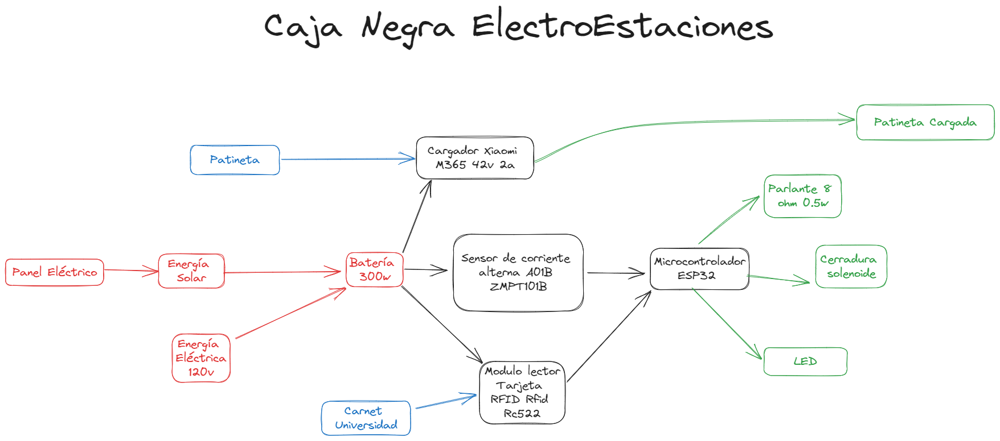
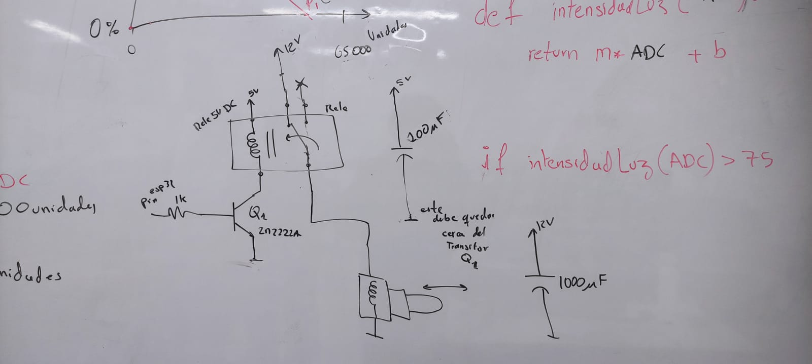
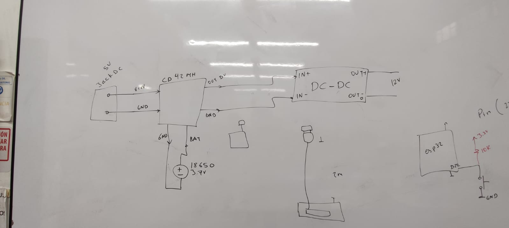

## **ElectroEstaciones**
Las patinetas eléctricas han experimentado un notable aumento en su adopción como medio de transporte en las últimas décadas, gracias a su carácter sostenible y eficiente que las posiciona como una alternativa atractiva. No obstante, este crecimiento conlleva desafíos significativos, especialmente debido a la carencia de una infraestructura adecuada para su carga y estacionamiento. Para abordar esta problemática, se propone la creación de una electroestación específicamente diseñada para patinetas eléctricas. Este prototipo incorpora un sistema de seguridad basado en la identificación por Radiofrecuencia (RFID) y tarjetas de acceso personalizadas para cada usuario, facilitando así un acceso rápido y seguro a la carga de las patinetas. La implementación de este prototipo no solo busca satisfacer la necesidad crítica de infraestructura para las patinetas eléctricas, mejorando significativamente la experiencia del usuario, sino que también aspira a estimular el uso masivo de este medio de transporte. Al reducir la dependencia de vehículos a combustión, se contribuiría de manera significativa a mitigar la huella de carbono, promoviendo un entorno urbano más limpio y saludable. En última instancia, la creación de esta electroestación no solo abordaría la problemática actual, sino que también sentaría las bases para una movilidad más sostenible y consciente en las áreas urbanas.

## **Diagrama de caja negra**
Esquema de alto nivel mostrando la interacción general de componentes sin entrar en detalles tecnológicos.

## **Diagrama tecnológico**
Versión detallada del diagrama de caja negra, incluyendo aspectos tecnológicos y arquitectónicos clave.

## **Diseños de circuitos en el salón de clase**
Fotografías que capturan el proceso de los diseños concebidos durante las clase de taller de ingeniería electrónica.

## **Implemetación**

### Esquemático Circuital (KiCad)
Visualización del esquemático circuital creado en KiCad, ofreciendo una representación clara de la estructura eléctrica.

### Ruteo en KiCad
Imágenes que ilustran el ruteo del circuito detallando la disposición física de los componentes.

### Diseño 3D (KiCad)
Representación tridimensional del diseño en KiCad, proporcionando una vista previa visual del producto final.

## **Pruebas de funcionamiento**
